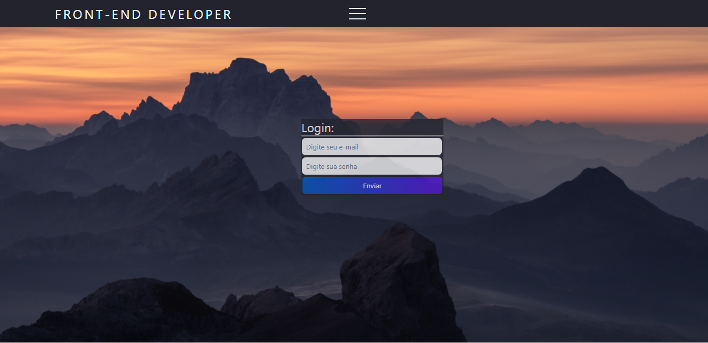

## Tela de Login Responsivo :
### Desenvolvimento Front-end, utilizando HTML5 e CSS3
### GITPAGES: <a href="https://maydoug.github.io/telalogin_responsivo/">VEJA O SITE ONLINE</a>
Esse projeto foi desenvolvido com sua responsividade em CSS3 e sua NavBar desenvolvida com CSS e JavaScript. 
